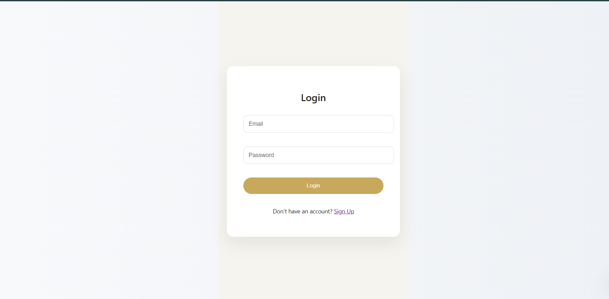
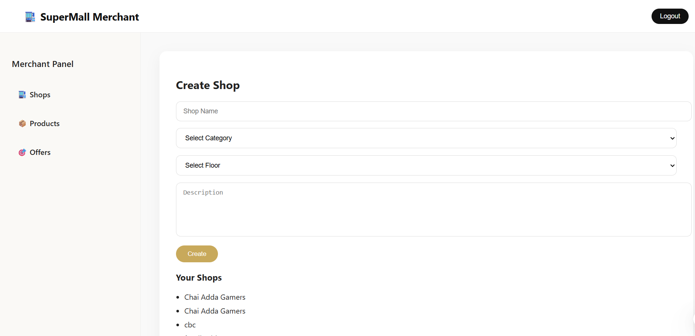
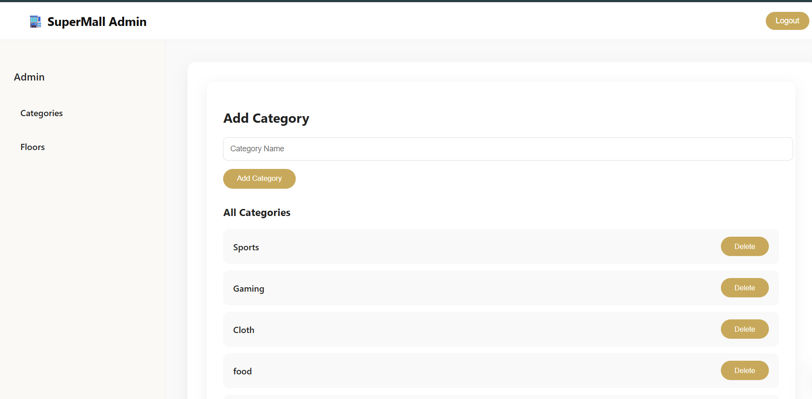

# 🚀 SuperMall Management System

A complete **role-based Mall Management System** built using:

- 🔥 Firebase Authentication  
- 🔥 Firebase Firestore  
- 💻 HTML, CSS, JavaScript  
- 🎨 Modern Responsive UI  

---

## 👥 User Roles & Features

### 🧑 User
- View shops
- Filter by category & floor
- Compare products
- View offers

### 🏪 Merchant
- Create shops
- Add products
- Create offers
- Manage own data

### 🛠 Admin
- Add / Delete categories
- Add / Delete floors
- Manage system data

---

## 🖼 Screenshots

### 🏠 Home Page

### 🔐 Login Page

### 🛒 Merchant Panel

### ⚙️ Admin Panel

---

## 🔐 Security

- Role-based Firestore rules
- Secure authentication using Firebase
- Data ownership validation

---

## 🛠 Tech Stack

- Vanilla JavaScript
- Firebase v8
- Firestore Database

---

## 👨‍💻 Author

**Kartik Sharma**
